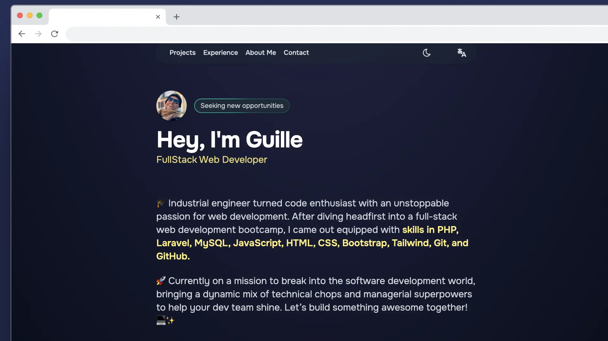

# Portfolio Personale





# Descrizione
Un portfolio web moderno e professionale sviluppato con Astro e Tailwind CSS. Questo progetto presenta un'interfaccia intuitiva e responsive che mostra i miei progetti, esperienze e competenze professionali.


# Caratteristiche
Design responsive: Ottimizzato per qualsiasi dispositivo e dimensione dello schermo
Supporto multilingue: Implementazione completa di localizzazione per spagnolo, inglese e italiano
Modalità chiara/scura: Opzioni di visualizzazione che si adattano alle preferenze dell'utente
Ottimizzazione delle prestazioni: Costruito con Astro per offrire un sito web veloce ed efficiente
Sezioni personalizzate: Presentazione, progetti, esperienza lavorativa e chi sono
Componenti riutilizzabili: Struttura modulare per una facile manutenzione.

# Tecnologie: 
Astro
Tailwind CSS
JavaScript
HTML
CSS

# Struttura del Progetto
Il sito è organizzato in componenti modulari che facilitano l'aggiornamento dei contenuti e la manutenzione del codice, con un'implementazione i18n per gestire più lingue (ES/EN/IT).

# Installazione
Prerequisiti
Node.js (versione 14 o superiore)
npm o yarn


Clone e installazione del progetto
# Clona il repository
```sh
git clone https://github.com/ghuamano/Personal_Portfolio.git
```

# Naviga alla directory del progetto
```sh
cd Personal_Portfolio
```

# Installa le dipendenze
```sh
npm install
```
# o se usi yarn
yarn install

# Avvia il server di sviluppo
```sh
npm run dev
```
# o con yarn
```sh
yarn dev
```

Build per la produzione
```sh
npm run build
```
# o con yarn
```sh
yarn build
```

Deployment
Il portfolio è disponibile all'indirizzo:
## 👀 [(https://guillermo-huaman-dev.netlify.app/it/)]
